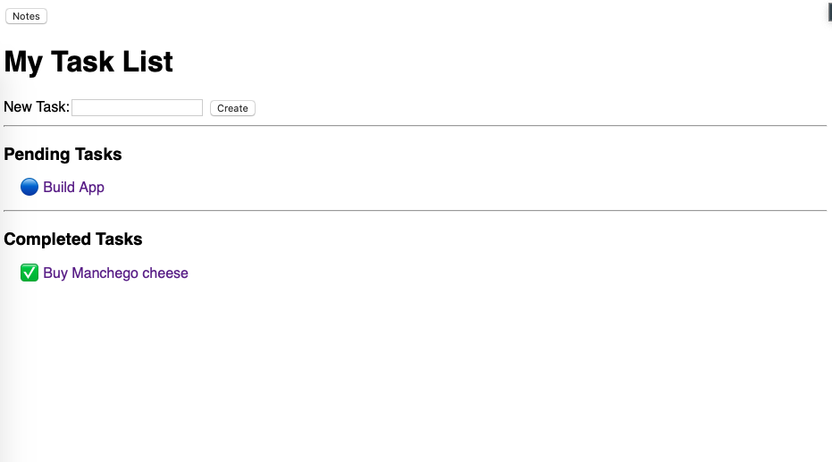
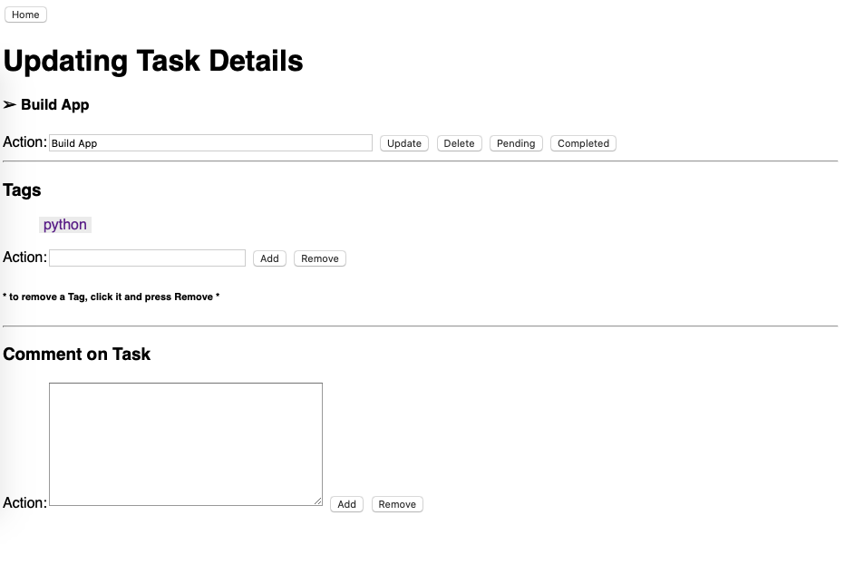
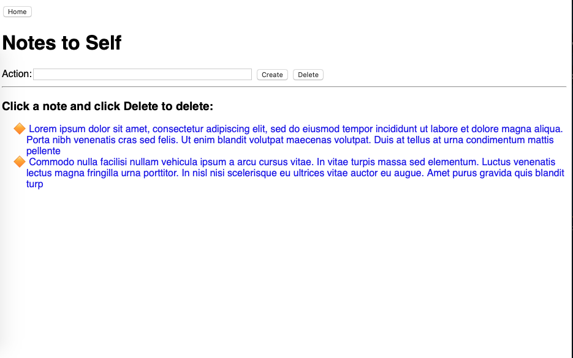

# todoapp_debug_project
Django app for the purpose of debugging practice

## About

This is a todo app for the purpose of learning the Django framework hands-on without having to attend to front-end matters.

Allow the user:
* Keep a list of tasks
* Mark them pending or complete, and reverse the status as such
* Update or delete the task
* Add comments to each task

Separate User Notes Area
* User may keep notes
* Update or delete the note

### Usage


Create a Python virtual environment and activate it in your local project: (assuming you already have Python installed)

```bash
$ cd <your_project_directory_name>
$ python3 -m venv venv
$ . venv/bin/activate
```

Install the packages from `requirements.txt`:

```bash
$ pip install -r requirements.txt
```

In the `<your_project_directory_name>/todosite/` directory run the following command to start the server:

```bash
$ cd todosite
$ python3 manage.py runserver
```

### 




